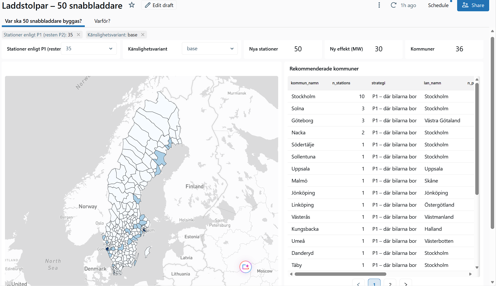
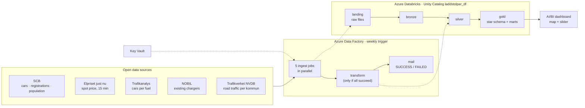

# Where should 50 fast chargers go?

**A cloud data warehouse that turns five open data sources into a transparent, adjustable investment recommendation for 290 Swedish municipalities.**

Built on Azure Databricks and Azure Data Factory · SQL-first · idempotent · ≈ 11 SEK per full pipeline run



---

## The business problem

A company is going to build **50 fast chargers** for electric cars in Sweden. Management wants them where they do the most good, judged on three criteria:

| Criterion | Evidence used |
|---|---|
| Many electric cars | Cars and new registrations per municipality (SCB) |
| A fleet that grows fast | Share of new cars that are electric (SCB) |
| Cheap electricity | Spot price per price zone (Elpriset just nu) |

There is no single right answer, because *"where the cars live"* and *"where the cars drive"* point to different places. So the solution doesn't give one answer. It gives management **a dashboard with a slider** to choose the mix between two strategies, and shows exactly why each municipality was picked.

| Strategy | Idea | Recommended |
|---|---|---|
| **P1 · Where the cars live** | Day-one volume: the most customers per station from the start | 35 stations |
| **P2 · Where the cars drive** | A national network along the trunk roads, so people dare to buy an EV | 15 stations |

## The result

At the recommended 35 + 15 mix (data as of 6 Oct 2026):

- **36 municipalities, 30 MW** of new fast charging
- **P1:** 35 stations in 21 municipalities: Stockholm 10 (the cap), Göteborg 3, Solna 3, Nacka 2, and one each in Malmö, Uppsala, Linköping, Umeå, Luleå and more
- **P2:** 15 municipalities with one station each, mostly along the E4 and E6: Nyköping, Tierp, Hudiksvall, Skellefteå, Varberg, Uddevalla, Tanum and more
- **Robust:** 29 of the 36 picks get a station in all 6 sensitivity variants. The marginal seats move, the core doesn't.

Some of what the data showed:

- **The EU charging target is already met 4×.** "Fill the gap" can't be the rule, so municipalities are ranked by demand, growth and missing supply instead.
- **"Busy roads" just measured city size.** The model now uses through-traffic per inhabitant, which is traffic that passes rather than traffic that lives there.
- **Ski resorts are already well served,** with 5–12× the national fast charging per EV on an average day.

## How the 50 stations are chosen

1. **Measure.** Six numbers per municipality: electric cars, growth, electricity price, chargers per car, through-traffic and chargers per traffic.
2. **Rank.** Each measure becomes a 0–100 position against the other 289 municipalities, so Stockholm's size doesn't flatten the rest.
3. **Weigh.** The two strategies weigh the positions differently (P1 favours volume and price, P2 favours growth and corridors).
4. **Allocate.** Stations are handed out one at a time, like Riksdag seats (Sainte-Laguë), per krona of build cost, with a maximum of 10 per municipality.

Every stage is a table in the gold layer, so any recommendation can be traced back to its numbers (the dashboard's *"Varför?"* page).

The hypotheses were written down before the runs, and the weights were not tuned to match them. The results confirmed that big cities need more stations and that regional centres and the network between them matter, and they showed that mountain resorts don't need extra. The limitations are listed openly at the end of this document.

## Architecture



| Layer | What happens | Run by |
|---|---|---|
| **landing** | Notebooks call the APIs (with retries) and save the raw JSON, unchanged, in a Unity Catalog Volume | ADF: 5 ingest jobs in parallel |
| **bronze** | Only new files are read (Auto Loader / file ledger) into Delta tables with `_file` and `_ingested_at` | same jobs |
| **silver** | Lakeflow declarative pipeline in SQL: clean, type, data-quality *expectations*, streaming tables and `AUTO CDC` (SCD 2) history | ADF: `transform` job |
| **gold** | Star schema (dimensions and facts at their own grain) | same pipeline |
| **marts** | Long-format scores and the allocation that the dashboard reads | same pipeline |

### Data model

A star schema with conformed dimensions (`dim_kommun`, `dim_drivmedel`, `dim_datum`, `dim_elomrade`) and facts at their own natural grain: month, year, day, station and kommun.

- Facts at different grains are kept as separate tables, because one wide table would mix them and invite wrong sums.
- Every fact joins on the same kommun, fuel and date keys.
- The marts are in **long format**, so a new criterion is new rows and not a schema change. Traffic was added to the model this way.

### Why these components

| Chosen | Why |
|---|---|
| **Unity Catalog + Volumes** | Raw files and governed tables in one catalog, with lineage |
| **Lakeflow declarative pipeline** | SQL with expectations, incremental loads and AUTO CDC for history |
| **Serverless compute** | No clusters to manage or leave running, and you pay per use |
| **SQL warehouse + AI/BI dashboard** | Reads gold directly, with no licence and no data copy |
| **Key Vault** | API keys never appear in code or in this public repo |
| **Data Factory + Logic App** | Orchestration, retries, schedule and status mail |

Rejected alternatives: **Power BI** (sharing needs a Pro licence), a **copy of gold in Azure SQL** (an extra pipeline step and a second copy of the data), and **classic clusters** (idle cost and admin, where serverless fits a trial budget).

## Production-minded engineering

This is built to be run by someone else, not just to work once.

- **Idempotent end to end.** Two full runs produced **0 new rows and 0 duplicate keys across 22 tables**, logged to `ops.run_validation`. Landing skips files it already has, bronze reads each file once, silver merges on keys, and gold is recomputed.
- **Retries, then a clear failure.** The notebooks retry 4 times with backoff (2, 4 and 8 s) and then raise an error naming the API, the call and the HTTP status. ADF retries the job twice more. The failure path was tested by forcing an HTTP 503 with the `simulate_http_status` parameter.
- **Alerting.** A SUCCESS or FAILED mail names the failing step and links to the run page.
- **Data-quality gates.** Failed expectations stop bad data before silver.
- **Scheduled.** Weekly, Monday 06:00 Stockholm time, because the sources change monthly or yearly and missed price days are backfilled. Daily would cost about 7× as much for the same decision. The trigger is stopped for now because the trial credit ends on 15 Oct.
- **Runbook.** [`RUNBOOK.md`](RUNBOOK.md) is a handoff for a colleague, with how to run it, where things live, an error-to-fix triage tree and the security notes.
- **Secure by default.** There are no secrets in code. Keys are read from Key Vault through a secret scope, and the NOBIL key is sent by POST so it never lands in a URL or log. ADF reaches Databricks through a managed identity, with no token and Contributor on a single resource only.

### Cost

About **1,010 SEK of the 1,904 SEK** trial credit was used in total.

- About **11 SEK** for a full automated pipeline run.
- About **22 SEK** to build the dashboard, on a 2X-Small warehouse that stops automatically after 5 minutes.
- About 75 % of the early spend was notebooks left attached to interactive serverless compute. After the cost rules (detach, batch checks, work locally), daily spend fell from **136 to 21 SEK**.

## Tech stack

Azure Databricks (Unity Catalog, Volumes, Lakeflow declarative pipelines, Auto Loader, Databricks Jobs, serverless SQL warehouse, AI/BI dashboards) · Azure Data Factory · Azure Logic Apps · Azure Key Vault · Managed Identity / RBAC · SQL · Python (requests, pandas, numpy, pyshp) · Delta Lake · Git

## Data sources

| Source | Content | Role | Licence |
|---|---|---|---|
| [SCB](https://www.scb.se/en/services/open-data-api/) | Cars, new registrations and population per kommun | required | CC0 |
| [Elpriset just nu](https://www.elprisetjustnu.se/elpris-api) | Spot price per zone, every 15 minutes | required | Free to use; no formal licence, attribution requested for public use |
| [Trafikanalys](https://www.trafa.se/sidor/oppen-data-api/) | Cars in traffic per fuel | extra | Free to reuse; source attribution required ("Källa: Trafikanalys") |
| [NOBIL](https://nobil.no/) | Existing charging stations (API key) | extra | CC BY 4.0 (attribution required) |
| [Trafikverket NVDB](https://www.trafikverket.se/) | Road traffic per kommun (yearly seed, preprocessed locally with `tools/`) | extra | CC0 |

**Attribution:** charging station data from [NOBIL](https://nobil.no/) (CC BY 4.0); statistics from Trafikanalys; electricity prices from [Elpriset just nu](https://www.elprisetjustnu.se/). Data licences are the providers' own and are separate from the MIT licence on this repository's code.

## Repository map

```
00_Setup.ipynb … 05_landing_nobil.ipynb   Landing + bronze notebooks (setup, APIs, seeds, NOBIL)
99_validate_run.ipynb                     Idempotency check → ops.run_validation
laddstolpar_transform/transformations/    Lakeflow pipeline: silver_*.sql, gold_dims/facts/marts/params.sql, ops_*_checks.sql
adf/                                      Azure Data Factory export (ARM templates) and the Logic App that sends the status mail
databricks_jobs/                          Databricks Jobs as YAML: five ingest jobs, seeds and the transform
dashboard/                                The AI/BI dashboard as a .lvdash.json export (importable in Databricks)
seeds/                                    Mapping and parameter CSVs (strategies, weights, cost factors, kommun/zone maps)
tools/                                    Local preprocessing of NVDB traffic data into a per-kommun seed
explore/                                  Exploration notebooks and the Trafikverket API probe (not part of the pipeline)
RUNBOOK.md                                Operations handoff
```

## Running it yourself

The orchestration and dashboard are exported as code, so the setup can be recreated: the ADF factory from `adf/` (ARM templates), the jobs from `databricks_jobs/` and the dashboard from `dashboard/`. The exports are **scrubbed**: the Logic App callback URL (which contains a signature), the subscription, tenant and identity IDs, the mail address and the workspace user path are placeholders you must fill in. Real values stay in Key Vault and ADF *Secure input*.

The pipeline runs in Azure (Databricks workspace, Data Factory, Key Vault) and needs your own subscription and API keys. See [`RUNBOOK.md`](RUNBOOK.md) for how to run, rerun and troubleshoot it. To use the local helper tools and probes:

```bash
python -m venv .venv
.venv\Scripts\activate          # PowerShell: .venv\Scripts\Activate.ps1
pip install -r requirements.txt
$env:TRV_API_KEY="..."          # Trafikverket key for the probe in explore/ (see .env.example)
```

## Limitations

- The weights and the P1/P2 mix are business choices, not facts. That's why there are sensitivity variants and a slider.
- Municipality is the unit. The model says *which* kommun, not which address or motorway exit.
- Company-registered cars place vehicles at head offices (68 % of Solna's cars). This is flagged, not corrected.
- Spot price is not the operator's cost, and there are only four price zones. Build-cost factors are assumptions, since there is no public cost data.
- Traffic covers state roads only, as an annual average, so seasonal peaks are missing.
- NOBIL's open dump covers about 95 % of NOBIL's own station count.
- The northern picks are the least robust across variants.

## What's next

- Site level within each kommun, using grid capacity and motorway exits
- Revenue and payback data to set the 35 + 15 mix
- Seasonal peaks for destination areas
- CI/CD and automated tests for the pipeline code

## Licence

Code: [MIT](LICENSE). The data sources keep their own licences, listed under *Data sources*.

---

**David Färm** · Data Engineering (DE25), Nackademin · Final project, October 2026

*Built as a course project using only open data. The recommendation is a decision basis, not investment advice.*
