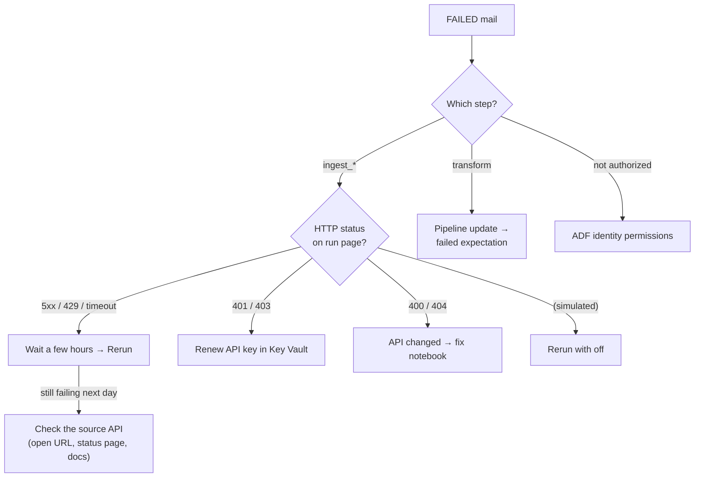

# Runbook – Laddstolpar pipeline

Handoff for the colleague who runs and fixes the pipeline. **Owner:** David Färm · **Updated:** 2026-10-06 · **Repo:** [DavidFarm/laddstolpar-databricks](https://github.com/DavidFarm/laddstolpar-databricks)

**What it does:** ADF runs 5 ingest jobs in parallel (API → landing files → bronze), then the Lakeflow pipeline `laddstolpar_transform` (silver → gold), and mails SUCCESS or FAILED. **Every step is idempotent, so a rerun is always safe.**

## 1. Run it

| Task | How |
|---|---|
| **Normal run** | ADF Studio → `pl_laddstolpar_main` → *Add trigger → Trigger now* → `simulate_http_status = off`. ≈ 30 min, ≈ 11 kr. Mail → david.farm12@outlook.com |
| **Schedule** | `tr_laddstolpar_weekly`, Mon 06:00 Stockholm. **Stopped** (Free Trial ends 15 Oct). Enable: *Manage → Triggers → Start → Publish all* |
| **Rerun** | ADF *Monitor* → failed run → *Rerun* |
| **Without ADF** | Databricks *Jobs & Pipelines* → `ingest_<source>` → *Run now*, then `transform` (no mail) |
| **Verify** | Notebook `99_validate_run` (set `label`) → `ops.run_validation`. Fails and names the table if any duplicate key exists |
| **Test failure path** | *Trigger now* with `simulate_http_status = 503` → FAILED mail in ≈ 5 min. **Never empty: use `off`** |

## 2. Where things live

- **Azure:** ADF `adf-laddstolpar` (pipelines `pl_laddstolpar_main` → `pl_laddstolpar_run`, linked service `ls_laddstolpar`) · Logic App `logic-laddstolpar-notify` (mails) · workspace `dbw-databricks-learn` · Key Vault `kv-labb2-df`
- **Databricks:** catalog `laddstolpar_df`: `landing` (Volume `raw`, raw API files) → `bronze` → `silver` → `gold`, plus `ops` (checks) · jobs `ingest_elpris`, `ingest_scb`, `ingest_trafa`, `ingest_chargers`, `seeds`, `transform` · secret scope `kv-labb2` · dashboard on warehouse `wh_laddstolpar`
- **Git:** notebooks `00`–`05` · `transformations/` (pipeline code) · `seeds/` (mapping and parameter CSVs) · `tools/` (local yearly preprocessing)

## 3. Troubleshooting

### 3.1 FAILED mail → which step, then what error

The mail says `Operation on target <step> failed: …`. For a job step it also has a **run page URL**: open it, and the notebook's own error is at the failing cell, e.g. `SCB | GET config | failed after 4 attempt(s): HTTP 503`.

| Error (mail or run page) | Fix → *still failing?* |
|---|---|
| `failed after 4 attempt(s): HTTP 5xx / 429 / Timeout` | Source down; already retried 4× in the notebook and 2× by ADF. Wait a few hours → *Rerun* → *still failing next day?* Open the API URL / source docs; if the API changed, see the next rows |
| `HTTP 401 / 403` | NOBIL key expired → new *version* of secret `nobil-api-key` in `kv-labb2-df` → *Rerun* → *still?* Check that the scope `kv-labb2` can read it (prints `[REDACTED]`). SCB 403 = query over the cell limit → check the paging in notebook `02` |
| `HTTP 400 / 404` | Our request no longer matches the API (version, table or variable code) → fix constants in Git → **pull in Databricks** → *Rerun*. (Elpris 404 = "not published yet", only a warning) |
| `(simulated)` | `simulate_http_status` left set → *Trigger now* with `off` |
| `Expected both 'key' and 'value'` | Empty parameter → default `off` in **both** pipelines → *Publish all* → *still?* Job got literal `@pipeline()…`: enter the value as *dynamic content* |
| `User not authorized` | ADF's managed identity lost access. Check all three: **Contributor** on `dbw-databricks-learn` (IAM) · service principal `adf-laddstolpar` in the workspace · **Can Manage Run** on the job |
| Step `transform` failed | A FAIL expectation stopped bad data before silver, by design → `laddstolpar_transform` → failed update → red dataset → expectation name → find the rows in bronze → fix SQL in Git → pull → run. Changed a streaming table's definition? → **Full refresh** that table (⚠️ NOBIL tables lose history) |
| `transform` *Skipped* | An ingest step failed first → fix that one |

### 3.2 Run succeeded, but something looks wrong

| Symptom | Check → fix |
|---|---|
| **No mail** | ADF *Monitor*: no run → trigger stopped or not published. Mail step failed → Logic App *Run history* → re-authorize the Outlook *API connection*, or paste a new URL into both `web_mail_*` (keep *Secure input* on) |
| **Prices missing** | Normal before ≈ 13:00. The next run backfills every missing day. Gaps: `ops.elpris_day_check` |
| **Code or seed change not used** | Jobs run the Workspace Git folder → *pull* and open the file to confirm. Seed changed → run `seeds`, then `transform` |
| **Dashboard slow first time** | Warehouse auto-stops after 5 min; the first query wakes it. Normal |
| **Pipeline warnings** | Expected: `source_end_consistent` 4 (source DST bug) · `has_state_road` 1 (Sundbyberg) · `all_inside_sweden` 17 · row-tracking tips on `seed_*`. **Anything else → investigate** |

### 3.3 Manual steps

- **Yearly:** add the new year to `YEARS` in notebook `03` (Trafikanalys). Rebuild the traffic seed locally with `tools/` → commit `seeds/nvdb_trafik_kommun.csv` → pull → run `seeds` + `transform`.
- **Production settings:** ADF activity retry is 2 × 60 s (test value), use 5 min. Budget alerts are set; ≈ 11 kr per full run.

## 4. Security

No secrets in Git: API keys are read from Key Vault through the secret scope, and the NOBIL key is sent by POST, so it never appears in a URL or an error. ADF reaches Databricks with its **managed identity** (no token). The **Logic App URL contains a signature, so treat it as a secret** (*Secure input* on; next step: move it to Key Vault).
